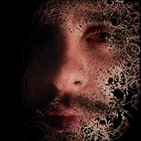

# Sopro

A vídeo projeção “Sopro” apresenta transformações em vídeo, com base na técnica de programação criativa, em que rostos de indígenas da Amazônia acreana, Povo Noke Koî, são transmutados em grafismos em sequência, ao som da fauna local. 

### Ficha Técnica:
- Criação: Guto Nóbrega e Vamoss
- Programação Criativa: Vamoss
- Fotografia: Guto Nóbrega
- Áudio: Guto Nóbrega
- Indígenas: Povo Noke Kôi

### Guto Nóbrega
.

[Atualizar texto]

### Vamoss
.

Vamoss é artista-programador, utiliza o código como matéria prima para criar projetos de arte gerativa.

É Diretor de Tecnologia na SuperUber, onde contribuiu para projetos de museus em todo mundo desde 2011.

É doutorando em Artes Visuais no PPGAV-UFRJ, na linha de Poéticas Interdisciplinares. Formado em Design e mestre em Economia Criativa pela ESPM-Rio, onde engajou com a comunidade de artistas-programadores brasileiros para criar o Encontros Digitais, um espaço de aprendizado em arte e novas tecnologias.

*Esta pesquisa recebeu apoio do Conselho Nacional de Desenvolvimento Científico e Tecnológico (CNPq) através da Bolsa de Produtividade em Pesquisa, concedida a Guto Nóbrega.*